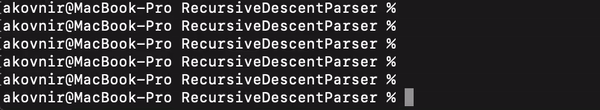

## Expressions Calculator 🧮

### Simple, straightforward, dump.

Uses [Recursive Descent Parsing](https://en.wikipedia.org/wiki/Recursive_descent_parser) algorithm.

## Supporting tokens:
- +/-
- \*
- ()
- one-digit numbers
